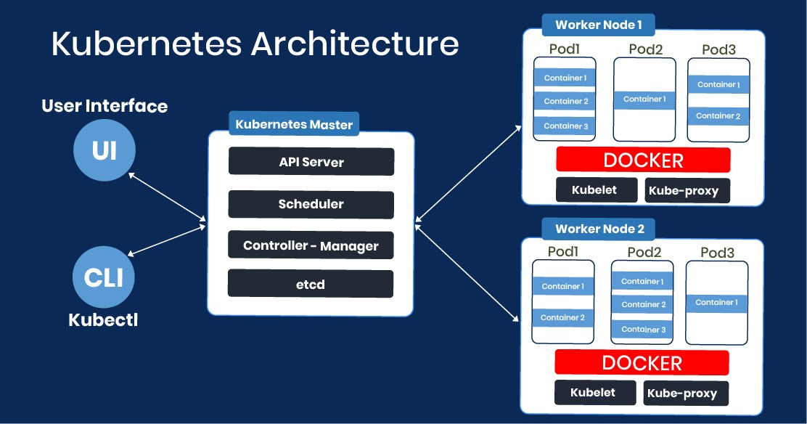

# Kubernetes (K8s)

=======

### What is Kubernetes?
> Kubernetes (also known as k8s or “kube”) is an open source container orchestration platform that automates many of the manual processes involved in deploying, managing, and scaling containerized applications.

### Why use Kubernetes?
Kubernetes makes building and running complex applications much simpler. Kubernetes provides you with:
* **Service discovery and load balancing**: Kubernetes can expose a container using the DNS name or using their own IP address. If traffic to a container is high, Kubernetes is able to load balance and distribute the network traffic so that the deployment is stable.

* **Storage orchestration**: Kubernetes allows you to automatically mount a storage system of your choice, such as local storages, public cloud providers, and more.

* **Automated rollouts and rollbacks**: You can describe the desired state for your deployed containers using Kubernetes, and it can change the actual state to the desired state at a controlled rate. For example, you can automate Kubernetes to create new containers for your deployment, remove existing containers and adopt all their resources to the new container.

* **Automatic bin packing**: You provide Kubernetes with a cluster of nodes that it can use to run containerized tasks. You tell Kubernetes how much CPU and memory (RAM) each container needs. Kubernetes can fit containers onto your nodes to make the best use of your resources.

* **Self-healing**: Kubernetes restarts containers that fail, replaces containers, kills containers that don't respond to your user-defined health check, and doesn't advertise them to clients until they are ready to serve.

* **Secret and configuration management**: Kubernetes lets you store and manage sensitive information, such as passwords, OAuth tokens, and SSH keys. You can deploy and update secrets and application configuration without rebuilding your container images, and without exposing secrets in your stack configuration.

Kubernetes saves developers and operators a great deal of time and effort, and lets them focus on building features for their applications, instead of figuring out and implementing ways to keep their applications running well, at scale.

### Kubernetes Architecture

The K8s architecture is relatively simple. You never interact directly with the nodes hosting your application, but only with the control plane, which presents an API and is in charge of scheduling and replicating groups of containers named Pods.

A brief description for some K8s components:

* *Nodes*: These machines perform the requested tasks assigned by the control plane.

* *Pod*: A group of one or more containers deployed to a single node. All containers in a pod share an IP address, IPC, hostname, and other resources. Pods abstract network and storage from the underlying container. This lets you move containers around the cluster more easily.

* *Service*: This decouples work definitions from the pods. Kubernetes service proxies automatically get service requests to the right pod—no matter where it moves in the cluster or even if it’s been replaced.

* *Kubelet*: This service runs on nodes, reads the container manifests, and ensures the defined containers are started and running.

* *Kubectl*: The command line interface that allows you to interact with the API to share the desired application state or gather detailed information on the infrastructure’s current state.
